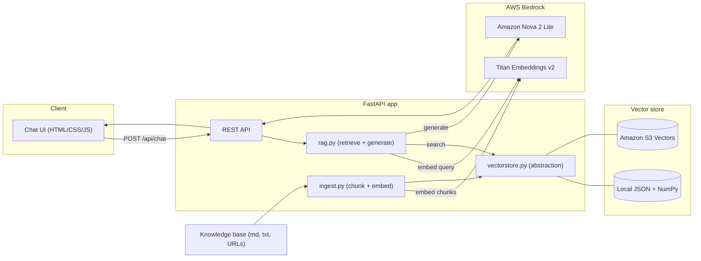
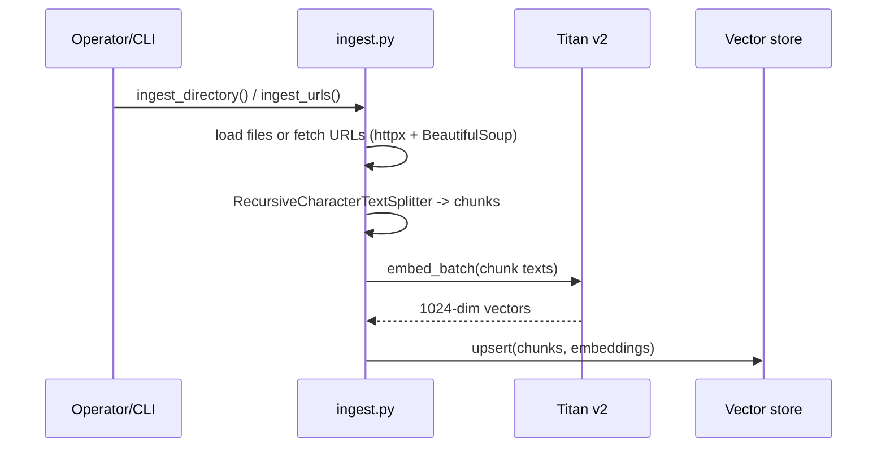
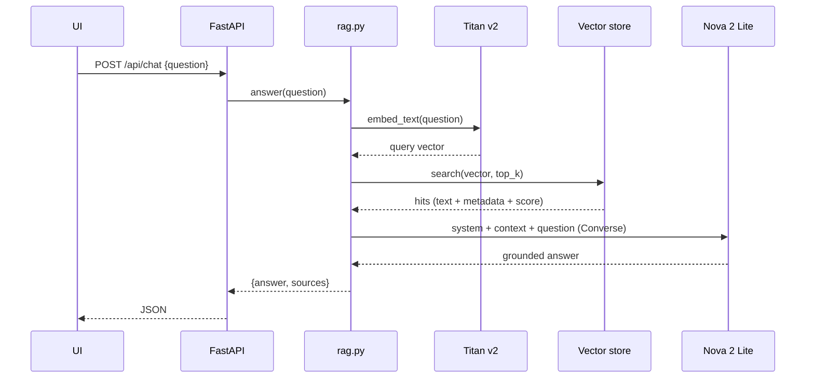

# Architecture — Developer Onboarding RAG

A retrieval-augmented generation (RAG) assistant that answers developer
onboarding questions from an org knowledge base plus Azure, GCP, AWS usage
guides and AWS FinOps guardrails.

## 1. Goals & non-goals

**Goals**
- Ground answers strictly in curated docs (no hallucinated policy/commands).
- Run locally with zero external vector infrastructure, and scale to a managed
  vector store without code changes.
- Keep the stack cloud-native to AWS (Bedrock for both LLM and embeddings).

**Non-goals**
- No user auth / multi-tenancy (single internal tool for now).
- No fine-tuning; retrieval + prompting only.
- No live agentic tool/MCP calls at answer time (docs are ingested ahead of time).

## 2. High-level architecture

## 3. Components

| Component | File | Responsibility |
| --- | --- | --- |
| Config | [backend/app/config.py](../backend/app/config.py) | Env-driven settings (models, region, backend, chunking) |
| Bedrock client | [backend/app/bedrock.py](../backend/app/bedrock.py) | Titan embeddings + Nova chat via Converse API, with retries |
| Vector store | [backend/app/vectorstore.py](../backend/app/vectorstore.py) | Common interface; local + S3 Vectors backends |
| Ingestion | [backend/app/ingest.py](../backend/app/ingest.py) | Read docs/URLs, chunk, embed, upsert |
| RAG chain | [backend/app/rag.py](../backend/app/rag.py) | Embed query, retrieve top-k, grounded generation, cite sources |
| API + UI host | [backend/app/main.py](../backend/app/main.py) | REST endpoints and static chat UI |
| Schemas | [backend/app/models.py](../backend/app/models.py) | Pydantic request/response models |
| CLI ingester | [scripts/ingest_docs.py](../scripts/ingest_docs.py) | Ingest a directory or list of URLs |
| Chat UI | [frontend/](../frontend) | Claude/Zara-inspired chat interface |

## 4. Data flows

### 4.1 Ingestion (offline / on demand)

### 4.2 Query (online)

## 5. Retrieval design

- **Chunking:** `RecursiveCharacterTextSplitter`, `CHUNK_SIZE=1200`,
  `CHUNK_OVERLAP=150`, markdown-aware separators.
- **Embeddings:** Amazon Titan Text Embeddings v2, 1024 dimensions.
- **Similarity:** cosine. Local backend computes it in NumPy; S3 Vectors uses a
  cosine index.
- **Top-k:** `RETRIEVAL_TOP_K=5` (configurable per request via `top_k`).
- **Metadata:** `source`, `chunk`, `category` (derived from KB subfolder). The
  chunk text is stored as non-filterable metadata under `text`.

## 6. Generation design

- **Model:** Amazon Nova 2 Lite (`us.amazon.nova-2-lite-v1:0`) via the Bedrock
  Converse API.
- **System prompt** enforces: answer only from context, say when undocumented,
  be concise, cite sources. See `SYSTEM_PROMPT` in
  [backend/app/rag.py](../backend/app/rag.py).
- **Params:** `LLM_TEMPERATURE=0.1`, `LLM_MAX_TOKENS=1024`.

## 7. API surface

| Method | Path | Purpose |
| --- | --- | --- |
| GET | `/api/health` | Status + active backend/model |
| POST | `/api/chat` | `{question, top_k?}` -> `{answer, sources[]}` |
| POST | `/api/ingest/local` | Ingest `data/knowledge_base/` |
| POST | `/api/ingest/urls` | `{urls[], category}` -> ingest web docs |
| GET | `/` | Serves the chat UI |

## 8. Configuration (env)

Key settings (see [.env.example](../.env.example)): `AWS_REGION`, `AWS_PROFILE`,
`BEDROCK_LLM_MODEL_ID`, `BEDROCK_EMBED_MODEL_ID`, `BEDROCK_EMBED_DIM`,
`VECTOR_BACKEND` (`local` | `s3vectors`), `S3_VECTOR_BUCKET`, `S3_VECTOR_INDEX`,
`RETRIEVAL_TOP_K`, `CHUNK_SIZE`, `CHUNK_OVERLAP`, `LLM_TEMPERATURE`,
`LLM_MAX_TOKENS`.

## 9. Deployment view

- **Local:** `uvicorn backend.app.main:app` + `VECTOR_BACKEND=local`. Only needs
  AWS credentials with Bedrock model access.
- **Cloud (target):** container (ECS Fargate / App Runner) behind an ALB;
  `VECTOR_BACKEND=s3vectors`; task role granting `bedrock:InvokeModel` and
  `s3vectors:*` (scoped). Bucket/index auto-created on first ingest.

## 10. Security & cost notes

- No static AWS keys in code; uses the default credential chain / task roles.
- Answers are grounded and cite sources to reduce misinformation risk.
- Titan embeddings are called one input at a time; batch ingestion is the main
  cost driver. Nova 2 Lite keeps per-query generation cost low.

## 11. Known limitations / future work

- No re-ranking; pure vector top-k. Could add a reranker or hybrid (keyword +
  vector) search.
- Titan embeds serially — parallelize for large corpora.
- Add evaluation harness (groundedness, answer relevance) and caching.
- Optional: live MCP/CLI tool calls for real-time cloud data.

See the Architecture Decision Records in [docs/adr/](adr/) for the rationale
behind these choices.
